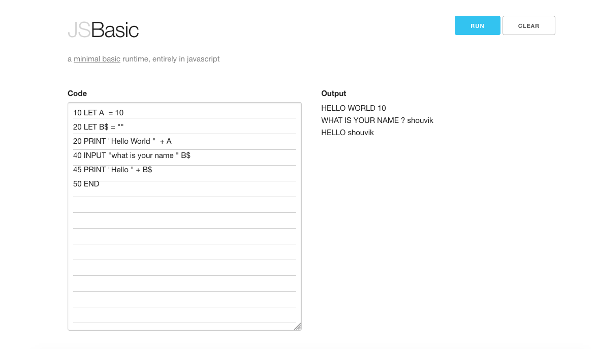

# JS-BASIC
A javascript based minimal basic compiler and runtime envionment

## Objectives

* [x] Create a frontend only minimal UI
* [x] Striped Editor where code will be written
* [x] Emulated Terminal, that can print
* [x] Emulated Terminal, that can handle input with callbacks
* [x] Run/Clear Button
* [x] Create a lexer, that can parse raw code and generated tokenised code
* [x] Create a parser, that can parse tokenised code and generated op code
* [x] Create a runtime, that can run op code and interact with emulated terminal for output and input
* [ ] Debugging Controls
* [ ] Show variable and call stack while debugging mode
* [ ] Show syntax errors

## Supported Commands

The runtime should be able to handle the below basic commands

### Data manipulation:

  - [x] `LET`—assigns a value (which may be the result of an
    [expression](expression_\(programming\) "wikilink")) to a variable.
  - [ ] `DATA`—holds a list of values which are assigned sequentially using
    the READ command.
  - [ ] `READ`-reads data from DATA statements into variables

### Program flow control:

  - [x] `IF ... THEN ... {ELSE}`—used to perform comparisons or make
    decisions.
  - [x] `FOR ... TO ... {STEP} ... NEXT`—repeat a section of code a given
    number of times. A variable that acts as a counter is available
    within the [loop](Control_flow#Loops "wikilink").
  - [x] `WHILE ... WEND`—repeat a section of code
    while the specified condition is true. The condition may be
    evaluated before each iteration of the loop.
  - [x] `REPEAT ... UNTIL`—repeat a section of code
    while the specified condition is true. The condition may be
    evaluated after each iteration of the loop.
  - [x] `DO ... LOOP {WHILE}` or {`UNTIL`}—repeat a section of code Forever
    or While/Until the specified condition is true. The condition may be
    evaluated before each iteration of the loop, or after.
  - [x] [`GOTO`](GOTO "wikilink")—jumps to a numbered or labelled line in
    the program.
  - [x] `GOSUB`—jumps to a numbered or labelled line, executes the code it
    finds there until it reaches a RETURN Command, on which it jumps
    back to the operator following the GOSUB – either after a colon, or
    on the next line. This is used to implement
    [subroutines](subroutine "wikilink").
  - [ ] `ON ... GOTO/GOSUB`—chooses where to jump based on the specified
    conditions. See [Switch statement](Switch_statement "wikilink") for
    other forms.

### Input and output:

  - [x] `PRINT`—displays a message on the screen or other output device.
  - [x] `INPUT`—asks the user to enter the value of a variable. The
    statement may include a prompt message.

### List of functions:

  - [x] `ABS`—Absolute value
  - [x] `ATN`—Arctangent value (result in [radians](radian "wikilink"))
  - [x] `COS`—Cosine value (argument in [radians](radian "wikilink"))
  - [x] `EXP`—Exponential value
  - [x] `INT`—Integer value
  - [x] `LOG`—Natural Logarithmic value
  - [x] `RND`—Random value
  - [x] `SIN`—Sine value (argument in [radians](radian "wikilink"))
  - [x] `SQR`—Square root value
  - [x] `TAN`—Tangent value (argument in [radians](radian "wikilink"))